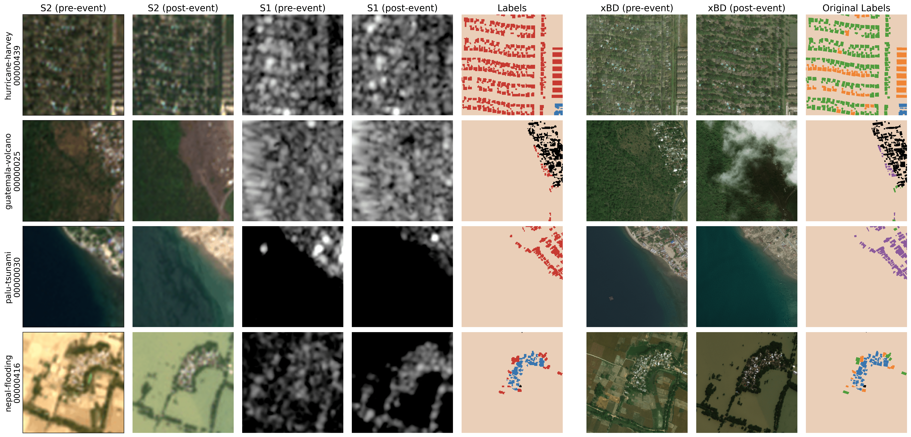

# The xBD-S12 Dataset

The dataset is organized around the `xbd_s12_metadata.geojson` file, which contains all relevant metadata for each patch. The index is the `xbd_uid`, a unique identifier for each patch. Below is a description of the key columns:

| Column | Description |
|---|---|
| `disaster` | Name of the disaster event associated with the patch |
| `disaster_type` | Category of the disaster (i.e. `volcano`, `flooding`, `wind`, `earthquake`, `tsunami`, or `fire`) following the xView2 challenge. |
| `peril` | Specific peril type (i.e., `volcano`, `flood`, `storm`, `earthquake`, or `wildfire`) following EM-DAT and Hafner et al. (2025) |
| `xbd_tier` | Original xBD tier assignment (`train`, `test`, `hold`, or `tier3`) |
| `event_split` | Split assignment for the event-based split from Hafner et al. (2025) (`train`, or `test`) |
| `best_utm` | The UTM zone that best covers the patch. Important to align the metadata of the original xBD dataset. |
| `N_intact`, `N_minor`, `N_major`, `N_destroyed`, `N_unclassified` | Number of buildings labeled as `intact`, `minor`, `major`, `destroyed`, or `unclassified`. |
| `N_total` | Total number of buildings. |
| `N_px_background`, `N_px_intact`, `N_px_minor`, `N_px_major`, `N_px_destroyed`, `N_px_unclassified`, `N_px_no_data` | Number of pixels belonging to the `background`, `intact`, `minor`, `major`, `destroyed`, `unclassified`, or `no_data` classes. |
| `xbd_date_pre`, `xbd_date_post` | Dates of the pre- and post-disaster satellite imagery used in the original xBD dataset. |
| `xbd_catalog_id_pre`, `xbd_catalog_id_post` | Catalog IDs of the MAXAR images used |
| `xbd_sensor_pre`, `xbd_sensor_post` | MAXAR Sensors used. |
| `xbd_perc_nan_pre`, `xbd_perc_nan_post` | Percentage of NaN values in the pre- and post-disaster satellite imagery. |
| `s2_mgrs_tile` | MGRS tile identifier for the Sentinel-2 images. |
| `s2_date_pre`, `s2_date_post` | Dates of the pre- and post-disaster Sentinel-2 imagery. |
| `s2_cs_pre`, `s2_cs_post` | Average cloud scores for the pre- and post-disaster Sentinel-2 imagery from Google Earth Engine's `CloudScore+` collection. |
| `s1_date_pre`, `s1_date_post` | Dates of the pre- and post-disaster Sentinel-1 imagery. |
| `s1_orbit_pre`, `s1_orbit_post` | Orbit identifiers for the pre- and post-disaster Sentinel-1 imagery. |
| `s1_direction_pre`, `s1_direction_post` | Orbit direction (`ASCENDING` or `DESCENDING`) for the pre- and post-disaster Sentinel-1 imagery. |
| `s1_ids_pre`, `s1_ids_post` | IDs of the Sentinel-1 images used, which can be used to retrieve the original Sentinel-1 data. |
| `geometry` | Polygon geometry of the patch in geographic coordinates (`EPSG:4326`), after alignment.

### Modalities

Three image modalities are included, each patch is resampled (using Lanczos) and cropped to **128×128 pixels**, matching the xBD tile extent. This results in a spatial resolution of about ~4 m GSD.

- **Sentinel-1** — Downloaded directly from Google Earth Engine. Amplitude bands (VV, VH) expressed in decibels. Occasional mosaicking applied where necessary.
- **Sentinel-2** — Downloaded using the [phi-down](https://github.com/ESA-PhiLab/phidown) library. All bands resampled to 10 m resolution. Values are in original reflectance scale.
- **Sentinel-2 TCI** — RGB composite used for visualization only. Also sourced via phi-down. No further processing; values are `uint8` [0–255].

The original (pre-tiling) satellite tiles are also available on Zenodo at this [URL](https://zenodo.org/records/18960454).

---

## Quick Exploration

The notebook [`xbd-s12_exploration.ipynb`](notebooks/xbd-s12_exploration.ipynb) provides a quick overview of the dataset, including patch visualization and metadata statistics.